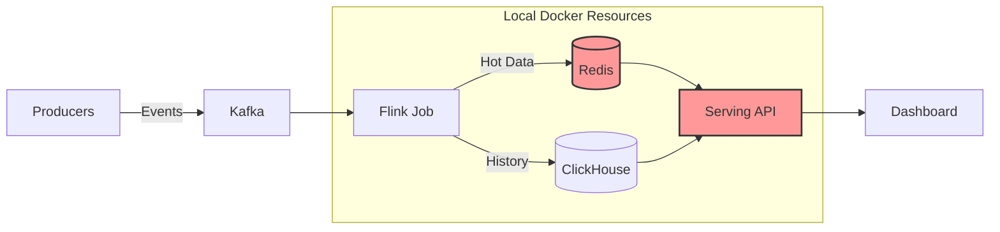
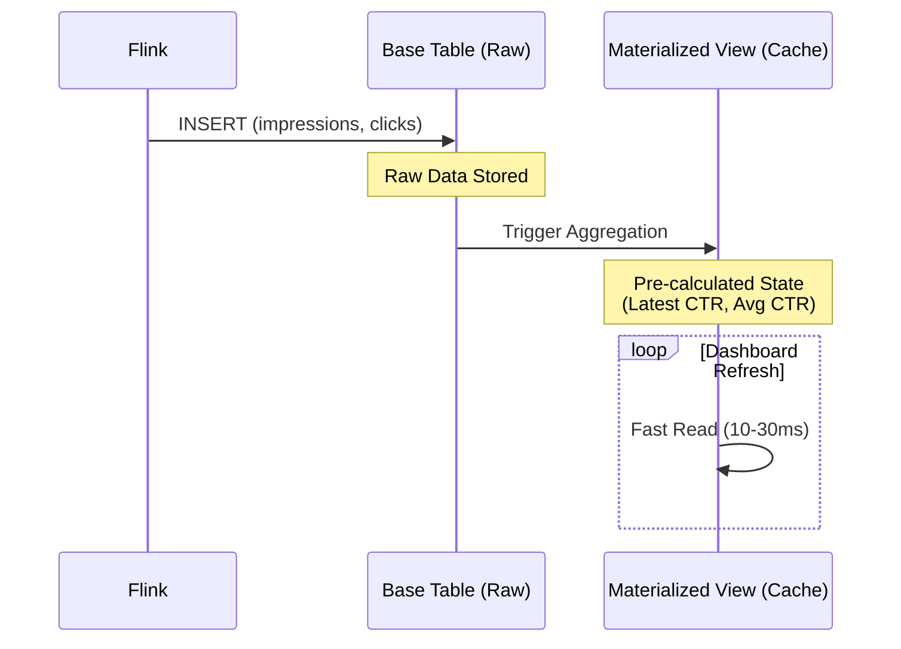
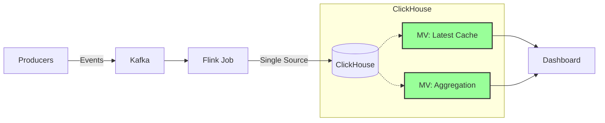

# MacBook Air M1의 처절한 생존기 (w/ ClickHouse): Redis를 버리고 단일 컨테이너로 살아남기

> 제 MacBook Air M1은 16GB RAM을 가지고 있습니다. 훌륭한 머신이지만, **Kafka, Flink, Redis, API 서버, ClickHouse**까지 로컬에 띄우기엔 턱없이 부족했습니다.
> 
> `docker-compose up`을 누를 때마다 이륙하는 팬 소음과 함께 멈춰버리는 IDE...
> 
> "살아남아야 한다."
>
> 이 글은 쾌적한 로컬 개발 환경을 사수하기 위해, **ClickHouse Materialized View** 하나로 인프라를 극한으로 다이어트한 기록입니다.

---

## 1. 문제의 시작: "내 노트북이 이륙하려고 해요" ✈️

개인 프로젝트로 실시간 추천 시스템을 구축하던 중, `docker-compose up`을 누르는 게 무서워졌습니다. 기본적인 데이터 흐름을 위해 띄워야 할 컨테이너가 너무 많았기 때문입니다.

### [Before] 과도하게 복잡한 로컬 아키텍처

### 내가 겪은 3가지 불편함 (Pain Points)
1. **리소스 부족**: Redis와 Serving API 컨테이너가 차지하는 메모리와 CPU 때문에 정작 중요한 Flink Job이 OOM(Out Of Memory)으로 죽는 경우가 빈번했습니다.
2. **관리 포인트 증가**: 스키마 하나를 바꾸려면 `Flink` 수정 -> `Redis` 데이터 초기화 -> `API` 코드 수정까지 3단계를 거쳐야 했습니다. 혼자 개발하는데도 Context Switching 비용이 너무 컸습니다.
3. **네트워크 오버헤드**: 로컬 환경임에도 데이터가 `Flink -> Redis -> API`를 거치며 불필요한 직렬화/역직렬화 비용이 발생했습니다.

**"만약 Redis와 API 서버를 없애고, ClickHouse 하나로 통일할 수 있다면?"**
이 가설이 맞다면, 내 노트북의 팬 소음도 줄어들고 아키텍처도 훨씬 깔끔해질 것 같았습니다.

---

## 2. 예측과 설계: ClickHouse는 Redis를 대체할 수 있을까?

물론 Redis는 빠릅니다(1ms). 하지만 제 프로젝트의 목표와 제약을 다시 생각해 봤습니다.

- **목표**: 실시간 대시보드에서 1초 주기로 CTR 변화를 모니터링한다.
- **제약**: 로컬 개발 환경이어야 하며, 리소스를 최소화해야 한다.
- **가설**: 1ms(Redis) 대신 50ms(ClickHouse) 정도면 충분히 "실시간"처럼 느껴질 것이다. 대신 복잡도를 획기적으로 낮출 수 있다.

또한, 아키텍처 관점에서 **Serving Layer(API+Redis)와 Storage Layer(ClickHouse)를 분리하는 관행**이, 오히려 소규모 프로젝트나 마이크로서비스 초기 단계에서는 불필요한 결합도(Coupling)만 높인다고 판단했습니다.

---

## 3. 해결책: Materialized View를 활용한 "Zero-Copy" 서빙

ClickHouse의 강력한 기능인 `Materialized View`를 활용하면, 별도의 애플리케이션 로직 없이도 데이터가 들어오는 순간 "미리 계산된 상태"를 만들 수 있습니다. 즉, **ClickHouse 스스로가 캐시 서버 역할까지 수행**하게 만드는 것입니다.

### [Concept] 데이터 흐름 단순화

### 적용한 3가지 View 전략
1. **`ctr_latest_view`**: Redis의 Key-Value 조회를 대체. 항상 최신 CTR 상태만 유지 (`ReplacingMergeTree`).
2. **`ctr_ml_view`**: 복잡한 집계 쿼리를 대체. 1분 단위로 미리 합계를 구해놓음 (`AggregatingMergeTree`).
3. **효과**: API 서버에서 하던 `Merge` 로직이나 `Filtering` 로직이 전부 SQL 레벨로 내려가면서 API 컨테이너 자체가 불필요해짐.

---

## 4. 검증 결과: 쾌적해진 개발 환경

실제로 Redis와 API 컨테이너를 제거하고 ClickHouse로 통합한 결과는 매우 만족스러웠습니다.

### 🚀 성능 증명 (로컬 벤치마크)
- **단건 조회**: 5~8ms. (Redis의 1ms보다는 느리지만, 대시보드용으로는 차고 넘침)
- **집계 조회**: 28ms. (기존 Python API에서 직접 집계할 때보다 오히려 10배 이상 빠름)

**(Image: [Screenshot] Tabix Query Performance)**
> *Tabix에서 쿼리 실행 시간이 수 ms 단위로 나오는 쾌적한 화면*

### 🧱 아키텍처 단순화 효과

- **Resource Free**: Redis와 API 서버가 먹던 약 1.5GB의 메모리를 확보해 Flink에 더 할당할 수 있었습니다.
- **One-Stop Query**: 모든 데이터를 SQL 하나로 조회할 수 있어 디버깅이 훨씬 쉬워졌습니다.
- **Deployment**: `docker-compose.yml`이 절반으로 줄어들어, 동료가 프로젝트를 클론 받아 실행할 때 실패할 확률이 거의 0%가 되었습니다.

---

## 5. 결론: "불편함"은 아키텍처 진화의 씨앗

이 작업은 단순히 "Redis를 뺐다"는 것 이상의 의미가 있었습니다.

1. **Trade-off의 재발견**: 무조건적인 "Best Practice(Redis 필수)"를 따르기보다, 현재 내 환경(로컬 개발, 리소스 제약)에 맞는 **"Right Practice"**를 찾아내는 과정이었습니다.
2. **미래를 대비한 Decoupling**: 향후 만약 트래픽이 폭증해서 다시 Redis가 필요해지더라도, 지금처럼 ClickHouse가 "Single Source of Truth"로 잡혀있다면, 단순히 캐시 레이어만 얹으면 됩니다. 오히려 데이터 정합성을 맞추기가 더 쉬워집니다.
3. **Developer Experience (DX)**: 개발 환경이 쾌적해야 코드 품질도 좋아집니다. 인프라 다이어트는 곧 나의 생산성 향상으로 이어졌습니다.

단순히 기능을 구현하는 것을 넘어, **"왜 이렇게 복잡해야 하지?"** 라는 의문을 품고 시스템을 경량화해 본 경험은 앞으로 더 큰 시스템을 설계할 때도 중요한 기준점이 될 것입니다.
